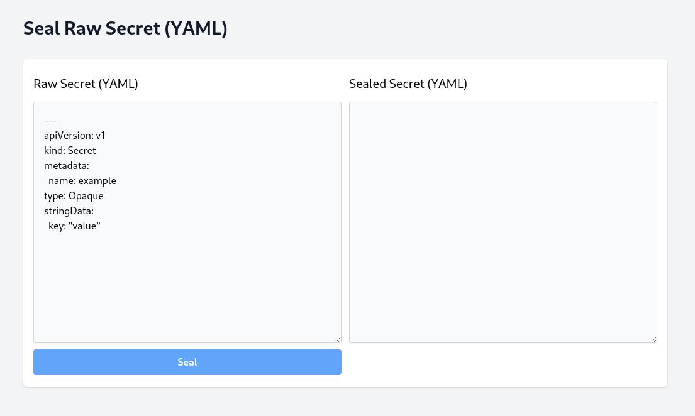

# kubeseal-web


🔐 Yet another web UI for protecting Kubernetes secrets with [Sealed Secrets](https://github.com/bitnami-labs/sealed-secrets).

_This is still under development. It works, but use at your own risk._



---

**Why do I need this?**

1. You want to provide developers with an easy way to seal secrets without installing `kubectl` and/or having access to the Kubernetes cluster
2. You do not want developers to be able to unseal / decrypt the sealed secrets (essentially write-only)
3. You want a simple solution that does not involve a lot of moving parts, and lots of manual set-up

_(3), the web UI was built using lightweight libraries (Tailwind CSS, and Alpine.js), and may run as a single binary / deployment._

**WARNING:** the web UI is NOT protected by any authN out-of-the-box. Though having it _publicly accessible_ does not pose any _significant risk_, it is highly recommended to limit its access to a trusted network and/or trusted identities to mitigate any potential for abuse (i.e. bring-your-own-auth).


## Deployment

The recommended way of installing `kubeseal-web` in your Kubernetes cluster is through creating your own "kustomization" file which references the [Kustomize](https://kustomize.io/) base manifests:

```yml
# kustomization.yml
resources:
  - github.com/MrSaints/kubeseal-web/k8s/kustomize/base?ref=master
```

### Recommendations

You may require the standalone `kustomize` binary instead of `kubectl apply -k` / `kubectl kustomize` as this project utilises some relatively new features.

It is recommended to pin any use of remote resources. See https://github.com/kubernetes-sigs/kustomize/blob/master/examples/remoteBuild.md for more information. It is also recommended to check your "kustomization" file into Git.

See [`k8s/kustomize/example`](k8s/kustomize/example) for an example on how you can extend, and customise the Kustomize base manifests (e.g. pinning the Docker image).

### Configuration

There are two environment variables which you should set:

- `KSWEB_SEALED_SECRETS_CONTROLLER_NAMESPACE`: Namespace of the sealed secrets controller (e.g. `kube-system`)
- `KSWEB_SEALED_SECRETS_CONTROLLER_NAME`: Name of sealed secrets controller (e.g. `sealed-secrets`)

They both correspond to the _Sealed Secrets_ deployment in your Kubernetes cluster. The web app will test for `kubeseal` access, and it will fail to start if these environment variables are not configured correctly!
